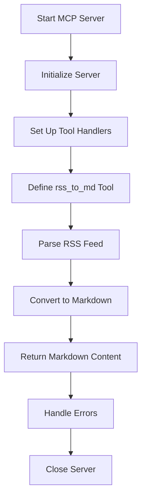

# RSS to Markdown MCP Server Implementation Plan

## Key Components

### 1. Server Initialization
- Create Stdio server transport
- Set up error handling
- Configure server capabilities

### 2. Tool Definition
- Name: `rss_to_md`
- Input: RSS feed URL (string)
- Output: Markdown content (string)
- Error handling: Invalid URLs, malformed RSS, network errors

### 3. RSS Parsing
- Use XML parser to extract feed data
- Extract key elements: title, description, items
- Handle different RSS formats

### 4. Markdown Conversion
- Convert feed metadata to Markdown headers
- Format items as Markdown list
- Include links and formatting
- Handle special characters

### 5. Error Handling
- Validate input URL
- Handle network errors
- Gracefully handle malformed RSS
- Provide meaningful error messages

### 6. Server Configuration
- Add to MCP settings file
- Set up environment variables if needed
- Configure for local Stdio operation